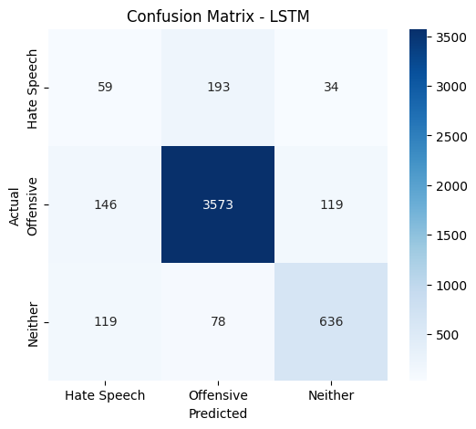
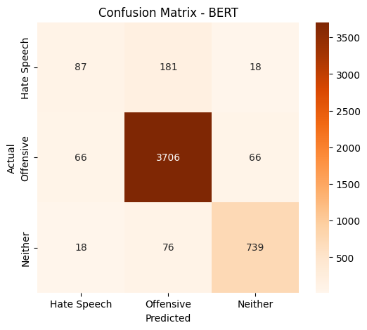
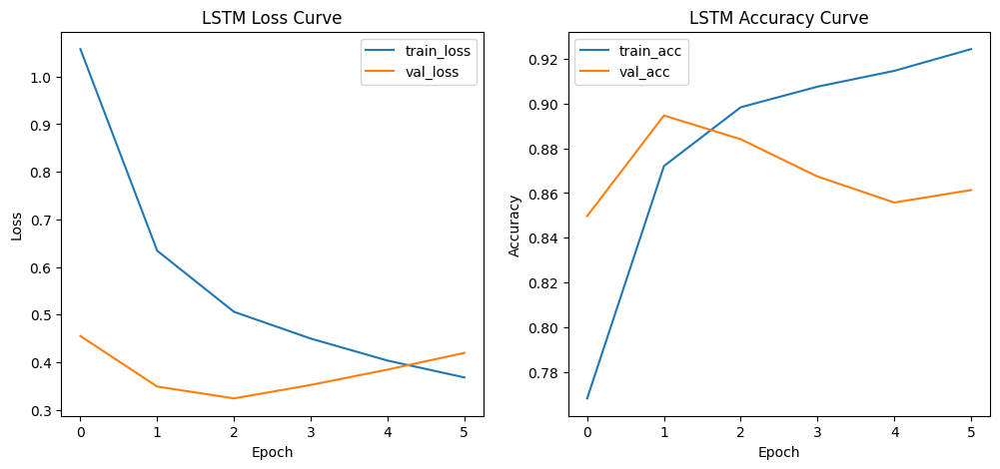
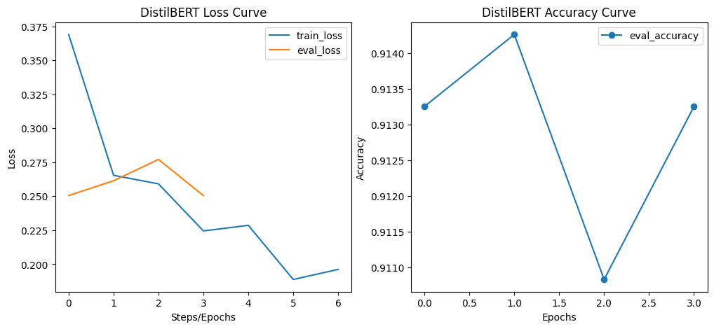
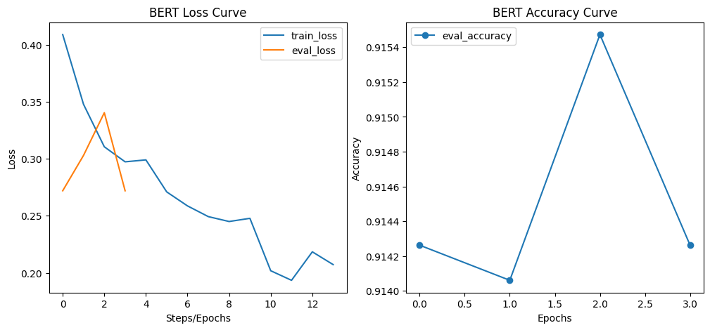
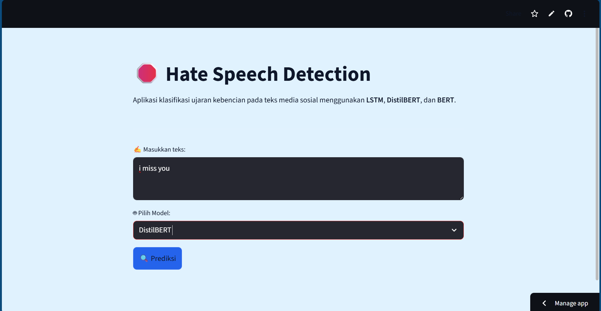
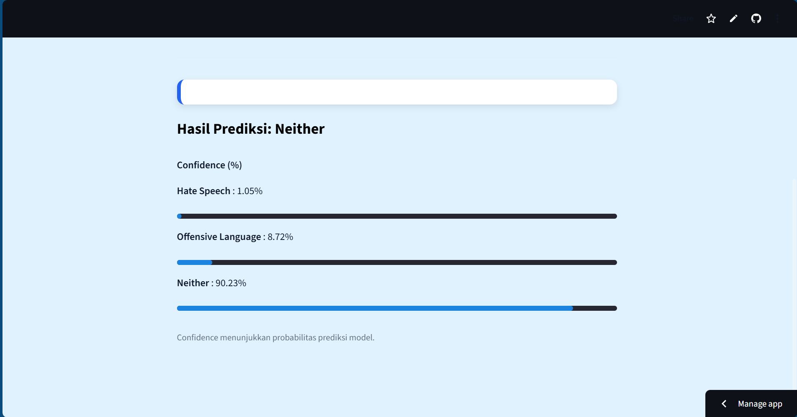

# 🛑 Hate Speech Detection — Text Classification on Social Media

Aplikasi klasifikasi ujaran kebencian pada teks media sosial menggunakan **Deep Learning** dan **Transformer-Based Models**.  
Proyek ini dikembangkan sebagai bagian dari **Ujian Akhir Praktikum (UAP) Pembelajaran Mesin**.

---

## 🌟 Overview
**Hate Speech Detection** adalah sistem klasifikasi teks untuk mendeteksi ujaran kebencian (*hate speech*) dan bahasa ofensif di media sosial. Sistem ini memanfaatkan beberapa pendekatan modern dalam *Deep Learning*:

✔ **LSTM** — Model neural network baseline tanpa pretrained embedding.  
✔ **DistilBERT** — Transformer ringan hasil distilasi dari BERT.  
✔ **BERT** — Transformer pretrained dua arah dengan performa terbaik.  

Sistem juga dilengkapi dengan **user interface berbasis Streamlit**, sehingga pengguna dapat langsung memasukkan teks dan melihat prediksi secara interaktif.

---

## 🔎 Dataset
📂 Dataset yang digunakan: **Hate Speech and Offensive Language Dataset**  
Sumber: [Kaggle](https://www.kaggle.com/datasets/mrmorj/hate-speech-and-offensive-language-dataset)

### Karakteristik Dataset:
- Jumlah data: >24.000 teks  
- Bahasa: Inggris  
- Jenis data: Teks media sosial  
- Kelas label:
  - **0: Hate Speech** (minoritas)
  - **1: Offensive Language**
  - **2: Normal**

Setiap entri berisi kolom teks dan label kategorikal, siap digunakan untuk pelatihan dan pengujian model.

---

## 🔎 Exploratory Data Analysis (EDA)
Analisis awal dilakukan untuk memahami distribusi data dan karakteristik teks:

| Analisis | Insight |
|----------|--------|
| Distribusi kelas | Tidak sepenuhnya seimbang; label "Neither" lebih dominan |
| Panjang teks | Bervariasi, sebagian besar berupa teks pendek |

📌 **Kesimpulan**: Perlu **tokenisasi dan padding** agar model dapat memproses input teks secara konsisten.

---

## 🧠 Preprocessing & Tokenization

Sebelum pelatihan model, data dipersiapkan melalui:

1. **Cleaning**: lowercase, hapus URL, simbol, dan stopwords.
2. **Tokenization**:
   - LSTM: Tokenizer Keras + padding `max_len=50`.
   - DistilBERT/BERT: Tokenizer spesifik model transformer + padding `max_length=128`.
3. **Label Encoding**: label diubah menjadi numerik (`0,1,2`).

---

## 📊 Models Implemented

| Model       | Type                  | Description |
|------------|----------------------|-------------|
| **LSTM**    | Neural Network Base   | Baseline model, menggunakan embedding sederhana dan Bidirectional LSTM. |
| **DistilBERT** | Pretrained Transformer | Ringan, cepat, menggunakan knowledge distillation dari BERT. |
| **BERT**   | Pretrained Transformer | Transformer dua arah, memahami konteks kalimat secara lebih baik. |

---

## 📈 Evaluation Summary

| Model       | Accuracy | Macro F1-score | Weighted F1-score | Insight |
|------------|----------|----------------|------------------|---------|
| **LSTM**   | 0.85     | 0.63           | 0.86             | Model baseline cukup baik. Kelas minoritas (Hate Speech) masih kesulitan terdeteksi karena distribusi data tidak seimbang. Menggunakan class weighting saat training. |
| **DistilBERT** | 0.914  | 0.752          | —                | Model ringan, hasil evaluasi menunjukkan akurasi 91.4% dan macro F1 0.75. Lebih stabil dibanding LSTM dan cocok untuk deployment real-time. |
| **BERT**   | 0.917    | 0.757          | —                | Transformer dua arah, performa terbaik: akurasi 91.7% dan macro F1 0.757. Memahami konteks teks lebih baik, namun memerlukan sumber daya komputasi lebih tinggi. |

---

## 🛠 How It Works

### Input
Pengguna memasukkan teks bebas melalui **form input Streamlit**.

### Output
Setelah klik **Predict**, sistem menampilkan:

- Prediksi label: *Hate Speech*, *Offensive Language*, atau *Neither*  
- Confidence score (%)  
- Progress bar yang menunjukkan probabilitas tiap kelas  

---
### Confusion Matrix, Loss & Accuracy

#### Confusion Matrix
Confusion Matrix untuk ketiga model (contoh, sesuaikan dengan plot hasilmu):

#### Loss Curve
Kurva Loss untuk ketiga model (contoh, sesuaikan plotmu):

#### Accuracy Curve
Kurva Akurasi untuk ketiga model:

#### Classification Report Summary

| Model       | Precision (macro avg) | Recall (macro avg) | F1-score (macro avg) | Accuracy |
|------------ |-------------------- |------------------ |------------------- |--------- |
| **LSTM**    | 0.64                | 0.63              | 0.64               | 0.86    |
| **DistilBERT** | 0.78             | 0.70              | 0.72               | 0.91    |
| **BERT**    | 0.78                | 0.72              | 0.74               | 0.91    |

---

## 🖼 Feature Screenshot & Live Demo
### Input Form

### Result View

💻 **Live Demo:** [Streamlit App](https://requirementstxt-8appf5qte4lxyw5efbymerm.streamlit.app/)

